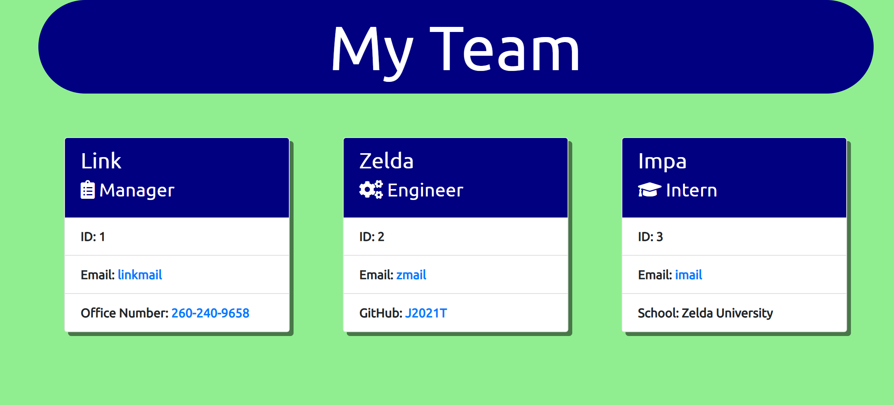

  # team-cards
  * 

  ## Description
  Team-cards is designed to create a page that displays cards for each team member with their specific data.  We did this so a team manager can easily find their teams info and reach out to the team.  This is a Node.js application designed to get user input to fill in the cards.

  ## Table of Contents
  * [Installation](#installation)
  * [Usage](#usage)
  * [Walkthrough-Video-Link](#walkthrough-video-link)
  * [Result-Screenshot](#result-screenshot)
  * [Contributing](#contributing)
  * [Tests](#tests)
  * [Questions](#questions)
  * [License](#license)

  
  ## Installation
  *  Download Node.js
  *  Clone repo to a local folder
  *  Open up repo in terminal of choice and type "npm install inquirer"
  
  
  ## Usage
  To utilize this project please first follow the installation steps.  Once you have installed the project please go to the folder location in your command line.  To start type "node index" and then follow the prompts.  When you are done adding employees to the team an index.html file and a style.css file will be ready in the dist folder.  Simply copy and paste those to the folder location you want to keep your team stored at.
  
  
  ## Walkthrough-Video-Link
  
  [Walkthrough video](https://drive.google.com/file/d/1Zg5Owlyoiipr25-xzcFebN4QDlAWwNai/view)
  
  
  ## Result-Screenshot
  
  
  
  
  ## Contributing
  To contribute clone the repo and make any changes you would like.  If you want please reach out via info in the questions section to discuss the changes you make.
  
  
  ## Tests
  Install jest and in the command line run npm test.
  
  
  ## Questions
  GitHub: [J2021T](https://github.com/J2021T)

  EMAIL: [jordan.turcott@gmail.com](mailto:jordan.turcott@gmail.com)
  
  
  ## License
  This project is covered under the [MIT](../assets/license-files/MIT.txt) license.

 
  
  
